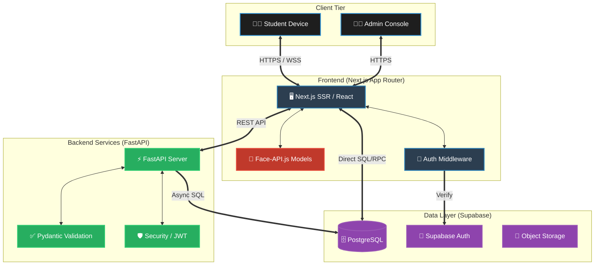

<div align="center">
  
  # 🛡️ ExamGuard
  
  **Next-Generation AI-Powered Exam Management & Remote Proctoring System**

  [](https://nextjs.org/)
  [](https://fastapi.tiangolo.com/)
  [](https://supabase.com/)
  [](https://github.com/justadudewhohacks/face-api.js)
</div>

<br/>

**ExamGuard** is a high-performance, enterprise-grade examination platform. Designed for modern educational institutions, it provides a highly secure and seamless examination experience through **real-time AI proctoring**, hybrid deployment capabilities, and a robust centralized dashboard.

---

## 🌟 Key Features

| Feature | Description |
| :--- | :--- |
| **🤖 AI Proctoring** | Real-time facial recognition and behavior monitoring via `face-api.js`. Detects multiple faces, no faces, or suspicious movements instantly. |
| **📊 Centralized Dashboard** | A comprehensive Admin portal for managing branches, students, subject tests, and tracking live exam telemetry. |
| **🛡️ Advanced Anti-Cheat** | Tab-switching detection, clipboard locking, full-screen enforcement, and continuous environment monitoring. |
| **⚡ Real-time Sync** | Instant updates between frontend interfaces and the backend powered by Supabase Realtime pipelines. |
| **📈 High Scalability** | Built to gracefully handle thousands of concurrent students with near-zero latency, powered by Python & FastAPI. |

---

## 🏛️ System Architecture

ExamGuard utilizes a decoupled, modern Microservices-inspired architecture.



### 🧱 3D Conceptual Model
> **Front-End Layer (The Surface):** Next.js handles the beautiful, glassmorphism-styled UI and client-side AI processing (to reduce server costs).
> **API Layer (The Core):** A lightweight FastAPI Python server processes complex validation and business logic.
> **Data Layer (The Foundation):** Supabase provides a scalable PostgreSQL database with Row-Level Security (RLS) ensuring strict data isolation.

---

## 🛠️ Technology Stack

### 🎨 Frontend
- **Framework:** Next.js (App Router) + React
- **Styling:** Premium Vanilla CSS Modules with Glassmorphism & Framer Motion
- **AI Integration:** Face-API.js (Browser-based ML models)
- **State Management:** React Hooks + Supabase Realtime

### ⚙️ Backend
- **Framework:** FastAPI (Python 3.10+)
- **Data Validation:** Pydantic
- **Authentication:** Supabase SSR Auth & JWT
- **Server:** Uvicorn ASGI

### 🗄️ Database & Infrastructure
- **Database:** PostgreSQL (via Supabase)
- **Containerization:** Docker (`Dockerfile` available)
- **Hosting:** Vercel (Frontend) & Render / Railway (Backend)

---

## 📂 Project Structure

```text
📦 EXAM
├── 📂 app/                   # Next.js App Router
│   ├── 📁 admin/             # Administrator dashboard & telemetry
│   ├── 📁 exam/              # Secure examination interface
│   ├── 📁 login/             # Authentication portals
│   └── 📁 instructions/      # Pre-exam guidelines & setup
├── 📂 backend/               # FastAPI Backend Service (Python)
│   ├── 📁 core/              # Security & Configurations
│   ├── 📁 models/            # Pydantic schemas
│   ├── 📁 routers/           # API endpoints (Auth, Exams, Logs)
│   └── 📄 main.py            # API entry point
├── 📂 supabase/              # Database Configuration
│   ├── 📄 schema.sql         # Base Table definitions
│   └── 📁 migrations/        # Database version control & updates
├── 📂 components/            # Reusable React UI components
│   ├── 📄 FaceMonitor.tsx    # Client-side AI Proctoring wrapper
│   └── 📄 AntiCheat.tsx      # Browser constraint enforcer
├── 📂 lib/                   # Shared utilities & Supabase clients
├── 📂 public/                # Static assets & ML model weights
└── 📄 DEPLOYMENT.md          # Step-by-step production guide
```

---

## 🚦 Quick Start Guide

### Prerequisites
- **Node.js:** v18.0+
- **Python:** v3.10+
- **Supabase Account:** For database and authentication setup.

### 1️⃣ Installation

Clone the repository to your local machine:
```bash
git clone https://github.com/meetukani34-prog/EXAM.git
cd EXAM
```

### 2️⃣ Frontend Setup
Install NPM packages and set up environment variables:
```bash
npm install
cp .env.example .env.local
```
*Edit `.env.local` and insert your `NEXT_PUBLIC_SUPABASE_URL` and `NEXT_PUBLIC_SUPABASE_ANON_KEY`.*

Start the frontend development server:
```bash
npm run dev
```

### 3️⃣ Backend Setup
Navigate to the backend directory and set up Python:
```bash
cd backend
python -m venv venv
# Windows: venv\Scripts\activate | Mac/Linux: source venv/bin/activate
pip install -r requirements.txt
```
Start the FastAPI server:
```bash
uvicorn main:app --reload
```

---

## 🔐 Security & Integrity

ExamGuard takes security seriously. 
- **Row Level Security (RLS)** in Supabase ensures students can only read their own exam papers and write their own results.
- **Client-Side Environment Locking** prevents copying, pasting, right-clicking, and switching tabs.
- **Continuous AI Telemetry** streams biometric checks to the backend every few seconds to flag anomalies for the administrators.

---

## 📝 License

This project is licensed under the **MIT License**.

---
<div align="center">
  <i>Designed & Developed with ❤️ for secure, modern education.</i>
</div>
